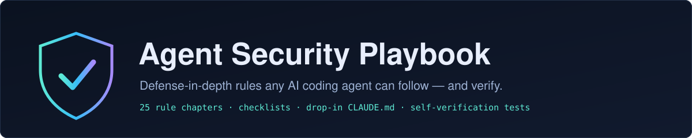

<p align="center">
  
</p>

<p align="center">
  <a href="LICENSE"></a>
  
  
</p>

<p align="center">
  <sub><b>COMPATIBLE WITH</b></sub><br>
  
  
  
  
  
</p>

# Agent Security Playbook

**Defense-in-depth security rules that AI coding agents can follow, and verify.**

Point any AI coding agent (Claude Code, Cursor, Copilot, etc.) at this repo, and it will apply a research-backed, testable rule set instead of shipping the happy path.

---

## 🚀 Quick start

### 1. With an AI agent (the main way)

Paste this into Claude Code, Cursor, or any coding agent, inside your project:

```text
Read https://github.com/MohammedAl-Alimi/agent-security-playbook
and follow AGENT-INSTRUCTIONS.md to audit this project for security issues.
```

or, when building something new:

```text
Read https://github.com/MohammedAl-Alimi/agent-security-playbook
and follow AGENT-INSTRUCTIONS.md while you build <your feature> securely.
```

The agent reads [`AGENT-INSTRUCTIONS.md`](AGENT-INSTRUCTIONS.md), maps your trust boundaries, applies the [16 rule chapters](#the-rules), and wires up tests that fail if a rule ever regresses.

### 2. As a permanent project default

Copy [`templates/CLAUDE-security.md`](templates/CLAUDE-security.md) into your project's `CLAUDE.md` (or `AGENTS.md`). Every future AI session then starts with all 23 core rules already loaded, and there's no need to point at this repo again.

### 3. As a human

Read [`PLAYBOOK.md`](PLAYBOOK.md) for the threat model, then keep the [checklists](checklists/) next to your code review:
[new feature](checklists/new-feature.md) · [new endpoint](checklists/new-endpoint.md) · [pre-deploy](checklists/pre-deploy.md)

---

## Why this exists

AI-generated ("vibe-coded") applications don't fail because the model writes broken crypto. They fail because the model **silently omits** the security layer: the RLS policy, the authorization check, the rate limiter, the webhook signature, the password hash. The feature still works in the demo, and that's exactly the problem.

The evidence (all sources in [`research/`](research/security_and_replication_findings.md)):

- Veracode's 2025 GenAI report: LLMs introduce vulnerabilities in **~45% of coding tasks**, and newer models improved at syntax, *not* security.
- GitGuardian: AI-assisted commits leak secrets at **more than 2× the human rate**.
- CVE-2025-48757: **170+ vibe-coded apps breached** through Supabase tables created without Row-Level Security.
- CVE-2025-29927: Next.js middleware-only auth **bypassed with a single spoofed header**.
- Stanford: developers using AI assistants wrote *less* secure code while rating it as *more* secure.

Reminders don't fix omission. **Structure does.** Every rule in this playbook is phrased as a testable imperative with a machine check (a test, a grep, or a CI gate) so a regression turns the build red instead of relying on anyone's vigilance.

---

## What you get

1. **[16 rule chapters](rules/)**: concrete DO/DON'T patterns for every layer, each rule with a ❌/✅ code pair and a **Verify** step.
2. **[Agent instructions](AGENT-INSTRUCTIONS.md)**: the executable entry point, with what an agent does step by step to build or audit securely.
3. **[The playbook](PLAYBOOK.md)**: the threat model and reasoning behind the rules.
4. **[A drop-in rules file](templates/CLAUDE-security.md)**: paste into your project's `CLAUDE.md` / `AGENTS.md` so every future session inherits the rules.
5. **[Checklists](checklists/)**: new feature, new endpoint, pre-deploy.
6. **[The research corpus](research/security_and_replication_findings.md)**: every CVE, incident, study, and exemplar repo the rules are built on.
7. **[AI Security Watch](WATCH.md)**: a daily-updated, agent-maintained log of new incidents and CVEs affecting AI-built apps.

Everything is generic-first: examples use Next.js / Supabase / Clerk / Stripe because they're common, but the patterns apply to any stack.

---

## The rules

| # | Chapter | The one-line version |
|---|---------|----------------------|
| 01 | [🔑 Authentication](rules/01-authentication.md) | Auth in every handler; middleware is never the boundary. |
| 02 | [🛡️ Authorization & RBAC](rules/02-authorization.md) | Every query that takes an ID also filters by the caller's identity. |
| 03 | [🧪 Input Validation](rules/03-input-validation.md) | Parse, don't validate: strict schemas at every trust boundary. |
| 04 | [🗄️ Database & RLS](rules/04-database-rls.md) | RLS on every table, in the same migration that creates it. |
| 05 | [🔐 Secrets & Environment](rules/05-secrets-and-env.md) | Secrets are structurally quarantined, scanned, and never client-prefixed. |
| 06 | [🔒 Hashing, Tokens & Credentials](rules/06-hashing-and-tokens.md) | Argon2id server-side; store only hashes; timing-safe compares; short-lived tokens. |
| 07 | [⏱️ Rate Limiting](rules/07-rate-limiting.md) | Global-store limits on every expensive route, failing closed. |
| 08 | [📨 Webhooks](rules/08-webhooks.md) | Verify the signature over the raw body first; missing secret = boot failure. |
| 09 | [📋 Logging & Errors](rules/09-logging-and-errors.md) | Generic errors out, structured redacted logs in, fail closed in catch. |
| 10 | [🧱 Headers, CSP & CORS](rules/10-headers-csp-cors.md) | Nonce-based CSP, exact-origin CORS, hardened cookies. |
| 11 | [📁 File Uploads](rules/11-file-uploads.md) | Magic-byte checks, private buckets, randomized keys, re-encode images. |
| 12 | [💳 Payments](rules/12-payments.md) | Fulfill from verified webhooks only, never from a redirect. |
| 13 | [🤖 SSRF & LLM Apps](rules/13-ssrf-and-llm.md) | Never fetch a user- or model-supplied URL raw; LLM output is untrusted input. |
| 14 | [📦 Supply Chain](rules/14-supply-chain.md) | Verify every package exists before installing; pin, lock, scan. |
| 15 | [✅ Self-Verification](rules/15-testing-verification.md) | Security regressions must turn CI red: negative tests for every rule. |
| 16 | [🗃️ Caching & CDN](rules/16-caching-cdn.md) | Personalized responses are never shared-cacheable; cache keys include the user. |

---

## License

[MIT](LICENSE). Use it, fork it, ship safer apps.
